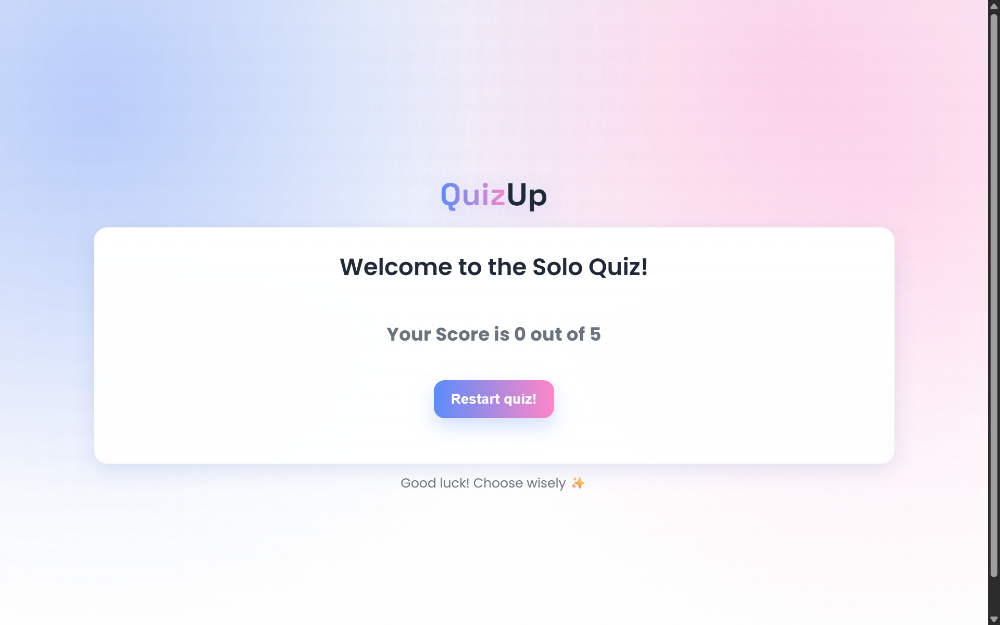
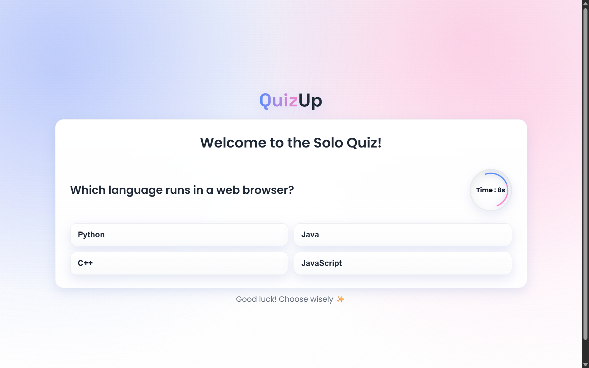

# QuizApp


**An interactive Quiz Application built using HTML, CSS, and JavaScript.**  
Test your knowledge with multiple-choice questions, get real-time feedback, and track your score.

---
## ✨ Features
- 🎯 **Dynamic question rendering** — Questions and options are generated from a JavaScript array.
- 🧩 **Multiple-choice options with instant validation** — Immediately shows correct or wrong answers.
- ⏱️ **Timer for each question** — Encourages quick thinking and adds a fun challenge.
- 🔊 **Interactive sound effects** — Plays sounds for correct, wrong, and missed answers.
- ⏭️ **Auto next-question flow** — Automatically moves to the next question after answering or timeout.
- 📊 **Final score display** — Shows your total score at the end of the quiz.
- 💡 **Restart functionality** — Allows restarting the quiz anytime.
- 📱 **Responsive design** — Works seamlessly on desktops, tablets, and mobile devices.
- ⚡ **Lightweight and fast** — No frameworks, only pure JavaScript, HTML, and CSS.

---


---

## Tech Stack
- **HTML5:** Structure and content  
- **CSS3:** Styling and layout  
- **JavaScript (ES6):** Quiz logic and interactivity  

---

## Project Structure
QuizApp/

├─ index.html # Main HTML file

├─ style.css # CSS styling file

├─ script.js # JavaScript quiz logic

├─ README.md # Project documentation

---

## Preview

<p align="center">
  
  
</p>

---

## How to Run Locally
1. **Clone the repository:**
```bash
git clone https://github.com/iamprashantverma/QuizApp.git
```
2. Navigate to the project directory:
```bash
cd QuizUp
```
3. Open index.html in your browser.

4. Click "Start Quiz" and begin answering questions �
